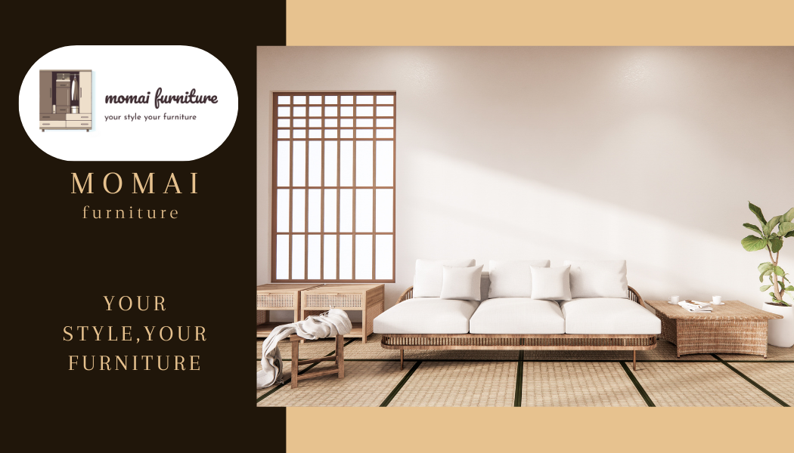

# 🪑 Momai Furniture - Handcrafted Portfolio Website

Welcome to **Momai Furniture**, a modern React-based portfolio website built to showcase handcrafted furniture, interior design, and restoration services.

### 💳 Banner & Logo
 <!-- Replace with actual image path or hosted link -->

---
### 💳 Website ScreenShot
 <!-- Replace with actual image path or hosted link -->

---
### 💳 Visiting Card
 <!-- Replace with actual image path or hosted link -->
 <!-- Replace with actual image path or hosted link -->

---

## 🚀 Live Demo

[View Website](https://yourdomain.com/MomaiCraftman) <!-- Replace with actual deployed URL -->

---

## 🛠️🪑 Momai Furniture Website Features
    🖼️ 1. Beautiful Portfolio Gallery
    Displays handcrafted furniture and interior design projects

    Supports category filtering:
    ✅ Custom Furniture
    ✅ Interior Design
    ✅ Restoration

    Interactive image hover effects and project details

    📋 2. Responsive Design
    Fully mobile-friendly and responsive

    Optimized for phones, tablets, and desktops

    Built with Bootstrap 5 for layout consistency

    🧰 3. Functional Contact Form
    Users can send messages with:

    Name, Email, Phone

    Subject and Message

    Form validation (required fields)

    Integrates with PHP backend to send email notifications

    🖥️ 4. Modern UI with Clean UX
    Uses Playfair Display and Inter Google Fonts

    Polished UI with modern color palette (browns, creams, earthy tones)

    Smooth section transitions and animation support (e.g., AOS)

    🧩 5. Reusable React Components
    Modular architecture using:

    "<PortfolioSection />"
    "<Contact />"

    Future extensibility for additional sections like blog/testimonials

    📦 6. Easy to Deploy
    Built using create-react-app

    Ready for deployment on:

    Shared hosting (e.g. Hostinger)

    Static hosts (Netlify, Vercel)

    Configurable subdirectory support (e.g., /MomaiCraftman)

---

